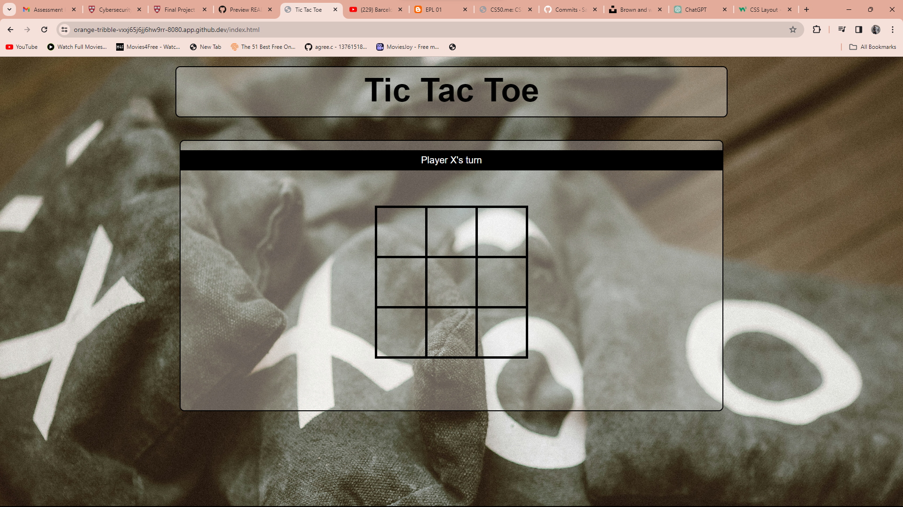

# Tic Tac Toe Pass-and-Play Game

## Introduction

Welcome to the Tic Tac Toe Pass-and-Play Game! This simple web application allows two players to engage in a classic game of Tic Tac Toe where they take turns making moves on a 3x3 grid. The game is designed to be played locally, allowing players to share a single device. The rules are straightforward – the first player to get three of their marks in a row (horizontally, vertically, or diagonally) wins the game. If all cells are filled without a winner, the game results in a tie.

## Table of Contents

- [Game Overview](#game-overview)
- [How to Play](#how-to-play)
- [Features](#features)
- [Technical Details](#technical-details)
- [Getting Started](#getting-started)
- [Development](#development)
- [Acknowledgments](#acknowledgments)

## Game Overview

### Screenshots




## How to Play

1. **Starting the Game**: Open the web application in a browser.

2. **Player Turns**: The game begins with Player X. Players take turns clicking on an empty cell to place their mark (X or O). The current player is displayed above the game board.

3. **Winning the Game**: A player wins by getting three of their marks in a row horizontally, vertically, or diagonally.

4. **Tie**: If all cells are filled and no player has three marks in a row, the game ends in a tie.

5. **Resetting the Game**: After a game concludes, an alert message will prompt players to reset the game. Clicking "OK" will clear the board and start a new game.

## Features

### 1. Pass-and-Play Gameplay

The game is designed for two players to take turns on a single device, making it a pass-and-play experience. This setup encourages a face-to-face interaction between players.

### 2. Player Turn Indicator

The current player's turn is prominently displayed above the game board. This indicator ensures that players are aware of whose turn it is, enhancing the overall gaming experience.

### 3. Winning and Tie Alerts

The game checks for a winner after each move, displaying an alert message if a player has achieved three marks in a row. In case of a tie, a separate alert notifies players of the draw.

### 4. Responsive Design

The web application is designed to be responsive, providing an optimal viewing and playing experience across various screen sizes and devices.

## Technical Details

### Technologies Used

- **HTML5**: Used for structuring the web page.
- **CSS3**: Employed for styling the page and creating a visually appealing layout.
- **JavaScript**: Implemented the game logic, user interactions, and dynamic updates to the DOM.
- **GitHub**: Utilized for version control and collaboration.

### Code Structure

The code is organized into three main sections:

1. **HTML Structure**: Defines the layout of the web page, including the game board and player turn indicator.

2. **CSS Styling**: Provides styling for the visual presentation of the game, ensuring a clean and user-friendly interface.

3. **JavaScript Logic**: Implements the game mechanics, including player turns, checking for a winner, handling ties, and resetting the game.

### Game Logic

The JavaScript code is responsible for managing the state of the game, processing player moves, checking for a winner or tie, and updating the DOM to reflect the current game state. It uses a 2D array to represent the game board and employs functions to handle player clicks, check for victory conditions, and manage game resets.

## Getting Started

To play the Tic Tac Toe Pass-and-Play Game, follow these steps:

1. **Clone the Repository**: Clone this repository to your local machine using the following command:

    ```bash
    git clone https://github.com/Samarbisht1208/Tic-Tac-Toe.git
    ```

2. **Open the HTML File**: Navigate to the project directory and open the `index.html` file in your preferred web browser.

3. **Play the Game**: Enjoy the game by taking turns with a friend to make moves on the game board.

## Development

If you wish to contribute or modify the game, follow these steps:

1. **Fork the Repository**: Click on the "Fork" button on the GitHub repository to create your copy of the project.

2. **Clone Your Fork**: Clone your forked repository to your local machine.

3. **Make Changes**: Make the desired changes or additions to the codebase.

4. **Commit and Push**: Commit your changes and push them to your fork on GitHub.

5. **Create Pull Request**: Open a pull request on the original repository, describing the changes you made.

## Acknowledgments

Special thanks to the open-source community for providing valuable resources and inspiration for building this Tic Tac Toe Pass-and-Play Game.

---

Feel free to customize this README file further based on your specific project details and requirements.
